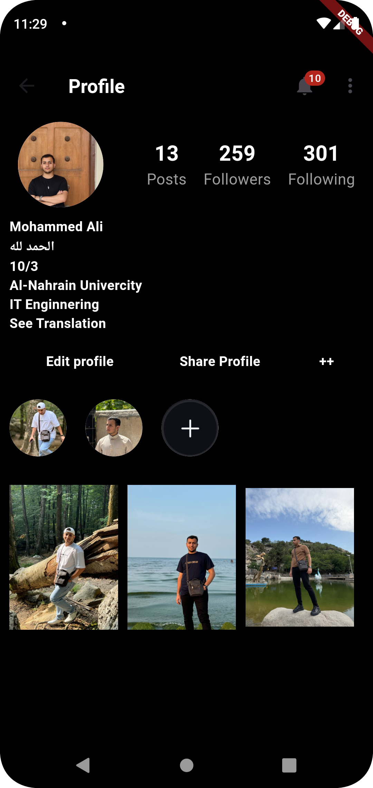

# instgram_profile

A new Flutter project.

## Getting Started

This project is a starting point for a Flutter application.

A few resources to get you started if this is your first Flutter project:

- [Lab: Write your first Flutter app](https://docs.flutter.dev/get-started/codelab)
- [Cookbook: Useful Flutter samples](https://docs.flutter.dev/cookbook)

For help getting started with Flutter development, view the
[online documentation](https://docs.flutter.dev/), which offers tutorials,
samples, guidance on mobile development, and a full API reference.

[Recording _Profile.mp4](..%2F..%2FUsers%2FWIN10%2FOneDrive%2F%D8%B3%D8%B7%D8%AD%20%D8%A7%D9%84%D9%85%D9%83%D8%AA%D8%A8%2Fphoto%2FRecording%20_Profile.mp4)